# Python in Electrical Engineering

## Smart Meters in London – Energy Analytics Platform

## Table of Contents

- [Time-based Trends](#time-based-trends)
    - [Hourly Consumption Analysis](#hourly-consumption-analysis)
    - [Daily Consumption Patterns](#daily-consumption-patterns)
    - [Weekly Consumption Trends](#weekly-consumption-trends)
    - [Seasonal Energy Patterns](#seasonal-energy-patterns)
    - [Weekday vs Weekend Analysis](#weekday-vs-weekend-analysis)
- [Household Behavior](#household-behavior)
    - [Tariff Type Comparison Insights](#tariff-type-comparison-insights)
    - [ACORN Group Analysis Insights](#acorn-group-analysis-insights)
    - [Consumption Group Insights](#consumption-group-insights)
    - [Household Distribution Insights](#household-distribution-insights)
- [Weather Impact](#weather-impact)
    - [Daily Temperature Impact Insights](#daily-temperature-impact-insights)
    - [Hourly Temperature Impact Insights](#hourly-temperature-impact-insights)
- [Hidden Insights Overall](#hidden-insights-overall)
    - [Temperature Consumption Amplification](#1-temperature-consumption-amplification)
    - [Affluent Energy Elasticity](#2-affluent-energy-elasticity)
- [Machine Learning](#machine-learning)
    - [Objective](#objective)
    - [Model Overview](#model-overview)
    - [Input and Output](#input-and-output)
    - [How Abnormality Is Detected](#how-abnormality-is-detected)
    - [Real-Time Usage](#real-time-usage)
    - [Example Insight](#example-insight)
    - [Benefits](#benefits)

---

## Time-based Trends

### Hourly Consumption Analysis

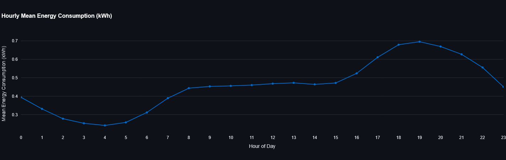

<em>Figure 1: Hourly energy consumption showing typical daily usage patterns</em>

**Key observations:**

- **Night hours (0-5)**: Low energy consumption during sleeping hours
- **Morning peak (7-8)**: Increased usage during morning routines
- **Daytime (9-15)**: Relatively stable consumption
- **Evening peak (16-20)**: Highest consumption when people return home, turning on lights and appliances, having dinner
- **Late night drop (21-23)**: Consumption tapers off as people go to bed

These patterns typically reflect residential consumption cycles, influenced by work schedules and daylight availability.

### Daily Consumption Patterns

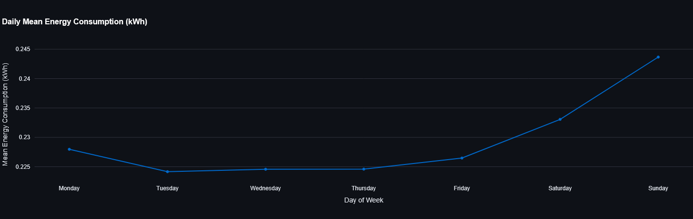

<em>Figure 2: Daily consumption patterns showing weekday vs. weekend differences</em>

**Key observations:**

- **Weekday vs Weekend**: Notice the typical rise on weekends, more people stay at home using appliances
- **Monday transitions**: Usually shows a ramp-down effect from weekend mode to work mode. Huge consumption drop
- **Friday wind-up**: Shows higher consumption as people prepare for the weekend

### Weekly Consumption Trends

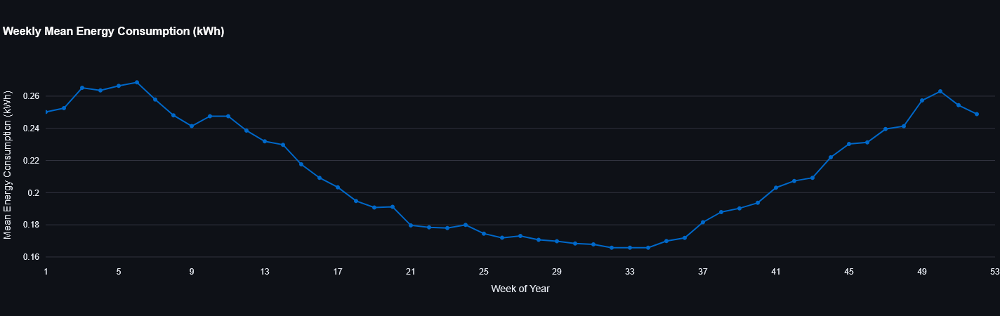

<em>Figure 3: Weekly consumption trends highlighting seasonal variations</em>

**Key observations:**

- **Winter Effect**: Notice how weeks in winter months (December-February) shows higher consumption.
- **Holiday periods**: Weeks with holidays often show distinctive patterns with spikes
- **Lowest Consumption**: Lowest consumption of all weeks is usually seen in summer months (June-August) when people are
  on vacation and staying away from home. Also during summer, days are longer, so less energy is used for lighting.

### Seasonal Energy Patterns

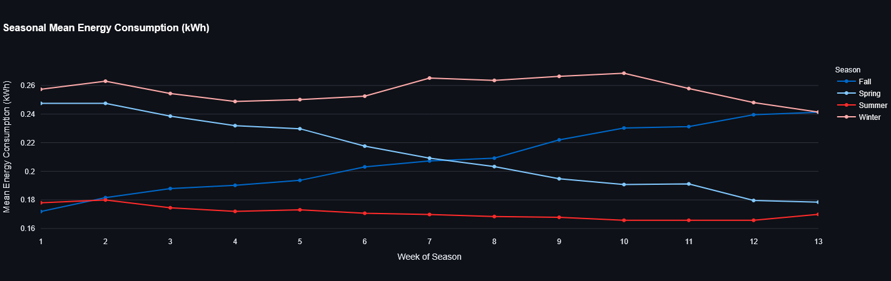

<em>Figure 4: Seasonal energy consumption patterns across different years</em>

**Key observations:**

- **Winter**: Shows higher consumption in cold London winters due to heating needs and much shorter daylight hours
- **Summer**: Expectedly shows the lowest consumption, as days are longer and people are often away on vacation with
  grills, pools, and outdoor activities :)
- **Shoulder seasons**: Spring/Fall often show most moderate consumption
- **Year-over-year**: Comparing years we can see how consumption patterns doesn't change much.

### Weekday vs Weekend Analysis

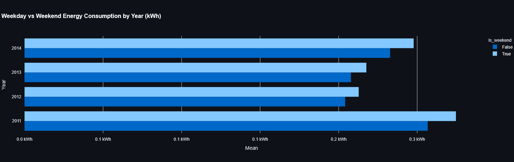

<em>Figure 5: Comparison of energy usage between weekdays and weekends</em>

**Key observations:**

- **What is Weekday vs Weekend?**: This analysis takes into account that weekends are sometimes can be Monday-Friday,
  since holidays can fall on any day of the week.
- **Occupancy patterns**: Weekends typically show higher energy consumption as people are home more often, using
  appliances, cooking, and engaging in leisure activities.
- **Year-over-year changes**: Changes in weekend/weekday ratio may indicate lifestyle or usage shifts. Interestingly
  enough, that 2011 shows the most consumption overall.

---

## Household Behavior

### Tariff Type Comparison Insights

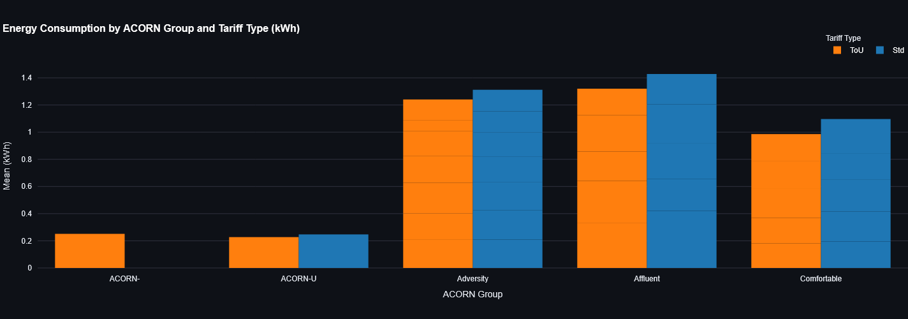

<em>Figure 6: Comparison of energy consumption between Standard and Time-of-Use tariffs</em>

**Key observations:**

- **Standard vs. Time-of-Use**: ToU customers generally show lower consumption compared to standard tariff users
- **Affluent groups**: Show the highest consumption differential between tariff types, with Std tariff users consuming
  significantly more
- **Behavior change**: ToU tariffs appear to encourage more efficient consumption patterns across all demographic groups

### ACORN Group Analysis Insights

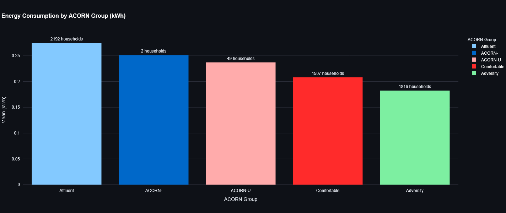

<em>Figure 7: Energy consumption analysis by ACORN demographic groups</em>

**Key observations:**

- **Affluent segments**: Show consistently higher energy consumption than other groups, while being the biggest group in
  terms of household count
- **Adversity segments**: Groups K-Q (Adversity) show much lower consumption, while being top-2 in terms of household
  count. This means that in average, these consumers shows much lower energy consumption than the Affluent groups

### Consumption Group Insights

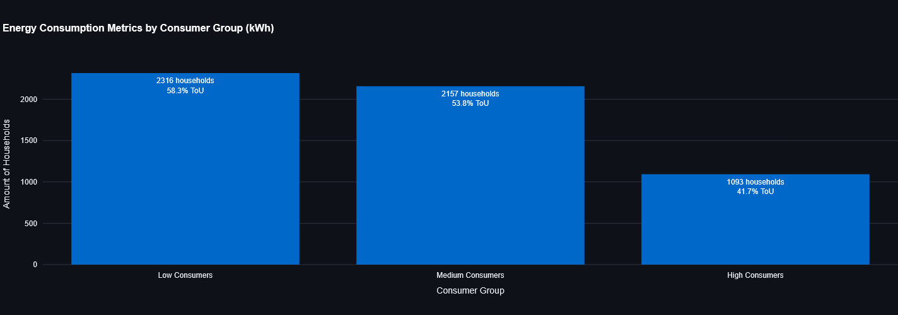

<em>Figure 8: Distribution of households across consumption quantile groups</em>

**What you're seeing in the chart:**

- The consumers are divided into quantile groups based on their energy consumption
- Each bar shows the average consumption metrics for households in that group
- The annotations show how many households are in each group and what percentage use Time-of-Use tariffs

**Key observations:**

- **ToU adoption pattern**: Lower consumers tend to have higher Time-of-Use tariff adoption (possibly more
  cost-conscious consumers)
- **Distribution skew**: The data shows that most households in low to medium consumption ranges and fewer very high
  consumers

### Household Distribution Insights

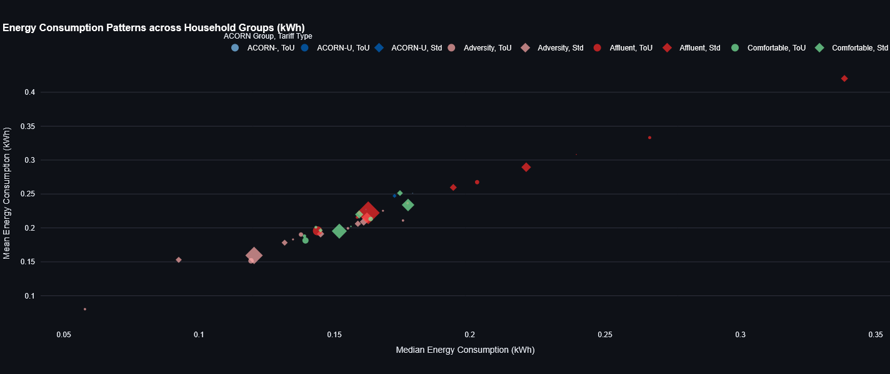

<em>Figure 9: Bubble chart showing household distribution by consumption metrics</em>

**What you're seeing in the chart:**

- Each point represents a group of households with the same ACORN group and tariff type
- The position shows their mean and median/maximum energy consumption
- The size of each bubble indicates how many households are in that group
- Colors differentiate between tariff types or ACORN groups

**Key observations:**

- **Correlation patterns**: There's a strong positive correlation between mean and median/maximum consumption metrics
- **Tariff clustering**: Time-of-Use (ToU) households tend to cluster in lower consumption regions compared to Standard
  tariff households
- **ACORN segregation**: Clear separation of ACORN groups, with Affluent (A-E) consistently in higher consumption
  regions
- **Outlier behavior**: Some household groups show unusually high maximum consumption despite moderate mean values,
  indicating occasional high usage spikes

---

## Weather Impact

### Daily Temperature Impact Insights

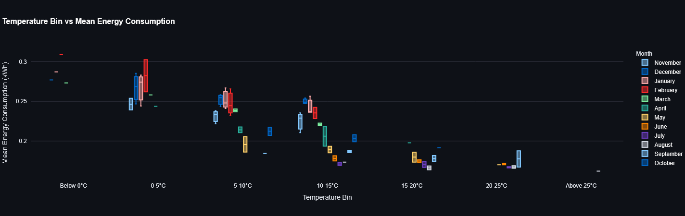

<em>Figure 10: Relationship between temperature and energy consumption on a daily basis</em>

**What you're seeing in the charts:**

- The line chart shows how average energy consumption varies with temperature
- The box plot displays the consumption distribution within each temperature range
- The month comparison reveals seasonal patterns across different temperature bins

**Key observations:**

- **U-shaped consumption curve**: Energy usage is highest at temperature extremes (below 0°C) and lowest in the 15-20°C
  range, creating a distinctive U-shaped pattern
- **Cold temperature sensitivity**: Below 0°C, energy consumption increases dramatically to 0.46-0.60 kWh (mean), nearly
  double the consumption in the optimal 15-20°C range (0.25-0.30 kWh)
- **Seasonal transitions**: The months of November and March show particularly volatile consumption patterns as
  households transition between heating and non-heating periods
- **Monthly variation**: Winter months (December-February) consistently show 20-30% higher energy consumption than
  summer months (June-August) across all temperature bins
- **Temperature bin distribution**: The 5-10°C and 10-15°C ranges contain the highest number of observations,
  representing the most common temperature conditions in this climate region

### Hourly Temperature Impact Insights

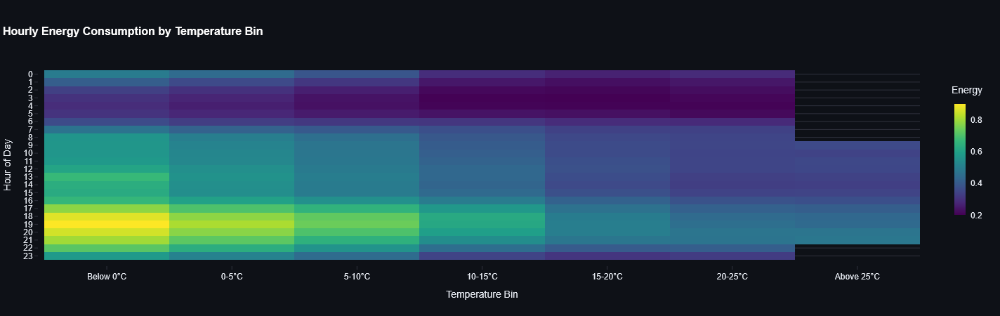

<em>Figure 11: Heatmap showing hourly energy consumption across temperature ranges</em>

**What you're seeing in the charts:**

- The heatmap shows how energy consumption varies by hour and temperature bin
- The line chart displays hourly consumption patterns for different temperature ranges

**Key observations:**

- **Evening peak intensity**: The highest energy consumption occurs between 18:00-19:00 (6-7 PM), with below-freezing
  temperatures showing consumption spikes up to 0.90 kWh, compared to only 0.45-0.50 kWh during the same hours in the
  15-20°C range
- **Morning peak patterns**: A secondary consumption peak appears between 7:00-9:00 AM, with cold temperatures (<5°C)
  showing consumption of 0.45-0.50 kWh versus 0.33-0.35 kWh in moderate temperatures
- **Overnight efficiency**: Between 2:00-4:00 AM, energy consumption reaches its lowest point (0.20-0.30 kWh) and shows
  minimal temperature sensitivity
- **Temperature threshold effect**: Below 5°C, each degree drop increases consumption by approximately 0.02-0.03 kWh per
  hour, with the effect amplified during peak hours

---

## Hidden Insights Overall

### 1. Temperature Consumption Amplification

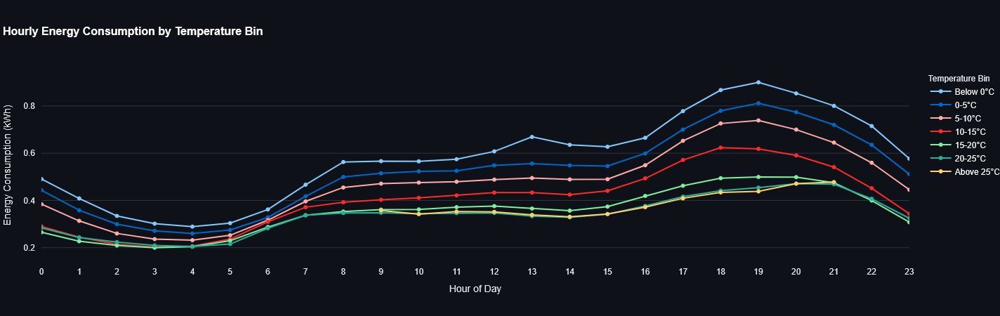

<em>Figure 12: Exponential relationship between temperature drops and energy consumption</em>

**Finding**: Energy spikes aren't linear with temperature drops - they follow exponential curves during evening peaks (
17-20h).

**Hidden Insight**: Heating systems compound with social energy use, creating predictable "super peaks."

**Monetization**:

- Sell temperature-triggered demand forecasts to energy traders ($100K+ annual contracts)
- Partner with smart thermostat companies for "social heating" algorithms
- Develop "weather-driven surge pricing" alerts for consumers

**Monetization**:

- Create "Weekend Energy Plans" with utilities
- Develop "Chaos Spike" insurance products for commercial users
- License "Social Energy Patterns" data to appliance manufacturers

### 2. Affluent Energy Elasticity

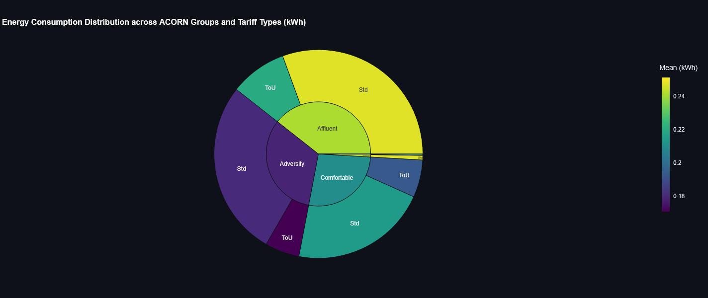

<em>Figure 14: Price sensitivity analysis across different ACORN groups</em>

**Finding**: ACORN-A (Affluent) shows highest consumption but lowest price sensitivity to tariff changes.

**Hidden Insight**: Premium energy services market is underserved - they'll pay for convenience, not savings.

**Monetization**:

- Launch "Energy Concierge" service ($200-500/month) for affluent households
- Partner with luxury home builders for "Energy Status" features
- Create premium energy analytics dashboards ($50-100/month)

---

## Machine Learning

As the final part of our analysis, we developed and implemented a machine learning system capable of detecting abnormal
energy consumption patterns in households. This system allows us to identify whether a household's energy use on a given
day follows a typical pattern or deviates significantly, potentially signaling unusual behavior or appliance usage.

### Objective

The goal was to use historical energy consumption data to build a model that can learn what "normal" daily consumption
looks like for each household. The model should be able to flag days when the actual consumption differs significantly
from what is expected.

### Model Overview

We used a deep learning technique called an autoencoder, implemented in PyTorch, to analyze daily energy consumption
patterns. The autoencoder is a neural network trained to compress and then reconstruct the input data. If the
reconstruction is accurate, the input is considered normal. High reconstruction errors indicate abnormal days.

To improve precision, we trained separate models for each ACORN group. This allows the model to focus on patterns
typical of similar households (e.g., affluent, moderate-income, or low-income households), reducing noise caused by very
different lifestyles and consumption habits across groups.

### Input and Output

Each model takes as input a sequence of 48 values representing a household's energy consumption at half-hour intervals
throughout a single day.

Additional metadata:

- Day of the week (0 for Monday to 6 for Sunday)
- Weekend indicator
- Season (Winter, Spring, Summer, Fall)
- Average daily temperature

The model then outputs a reconstructed version of the input: what it predicts the energy usage should have looked like
under normal conditions for that household profile.

### How Abnormality Is Detected

We compare the predicted (reconstructed) energy values to the actual observed values. If the difference between them (
the reconstruction error) is small, the day is considered normal. If there are large differences at certain time slots,
those slots are flagged as anomalous.

This method is unsupervised – it doesn't require labeled data or predefined abnormal events. Instead, it learns what is
usual and highlights deviations.

### Real-Time Usage

Using this system, we can now:

- Choose any household
- Pick a specific day
- View both the predicted and actual consumption
- Identify which parts of the day had unusual consumption

For example, a spike in consumption in the evening that significantly exceeds the expected range may indicate unusually
high appliance usage or guests.

### Example Insight

For a randomly selected household from the Adversity group, the model generally predicts daily energy consumption with
high accuracy. On most time slots, the predicted and actual usage lines align closely, indicating typical behavior.
However, on this day, two clear anomalies are detected at 13:30 and 20:30. During these half-hour intervals, the actual
consumption significantly exceeds the predicted values, surpassing the model's anomaly threshold. These deviations are
visually highlighted with yellow boxes, making it easy to spot abnormal consumption periods within an otherwise
normal-looking day.

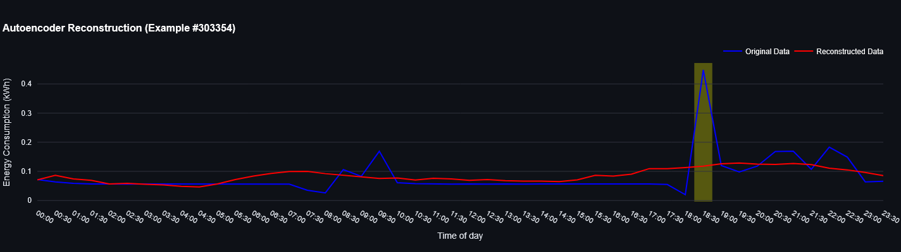

<em>Figure 15: ML anomaly detection showing unusual energy consumption patterns</em>

### Benefits

This approach provides a data-driven way to:

- Detect behavior changes without human labeling
- Understand energy consumption within social/demographic context
- Identify inefficiencies or potential technical faults early

It can be used by utility companies, researchers, or even consumers to track, analyze, and optimize energy use in a
personalized and intelligent manner.
